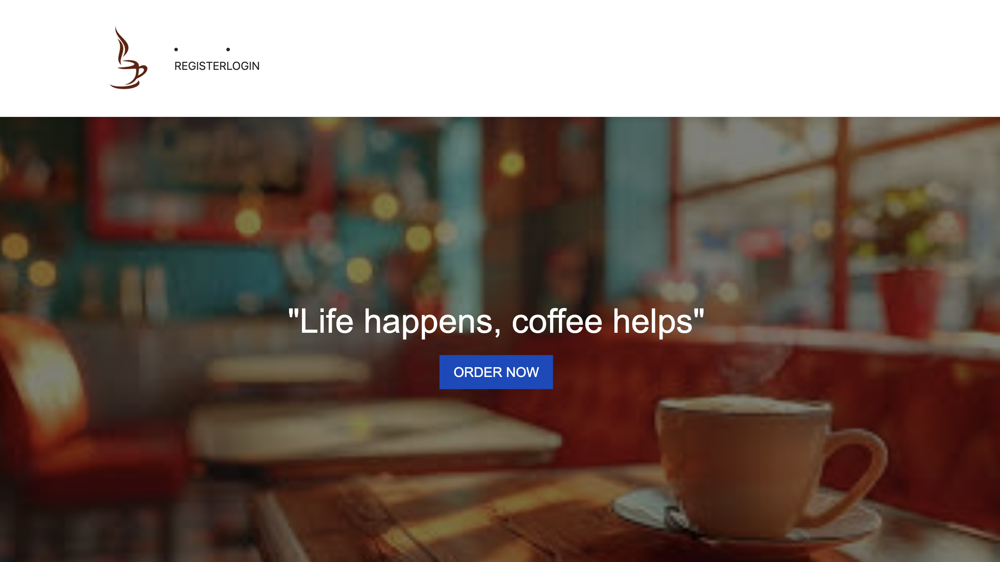

# MYCAFE Angular Project

This Angular project is a simple cafe ordering system with **user authentication** and a seamless ordering experience.

## Project Overview
- The application starts with a **login page** where users must validate their credentials.
- Upon successful login, users are redirected to the **menu page** to view and select food items.
- After selecting items and clicking **Order Now**, they are redirected to the **dashboard page**.
- The dashboard displays the logged-in **username** and the **total amount** for the selected items.

## Features
1. **User Authentication:** Validates user credentials before granting access.
2. **Menu Page:** Displays a variety of food items for selection.
3. **Order Summary (Dashboard):** Shows the logged-in username and the total cost.

| Login Page | Menu Page | Dashboard | Home Page |
|------------|-----------|-----------|-----------|
|  |  |  |  |


## Technologies Used
- **Frontend:** Angular
- **Styling:** CSS
- **Backend:** Firebase


## How to Run the Project
```bash
git clone <repository-url>
cd cafe-angular
npm install
ng serve
